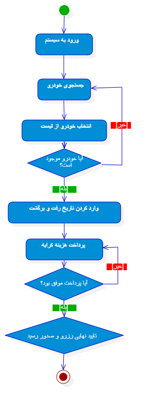

# مستندات فنی تحلیل، طراحی و مدل‌سازی سیستم مدیریت کرایه خودرو (Car Rental System)
**پروژه درس مهندسی نرم‌افزار / تحلیل و طراحی سیستم‌ها**

---

## مشخصات طراح پروژه
* **نام سازنده:** محمد صدرا امینی
* **کد دانشجویی:** 03211020302041  
* **ایمیل:** `mr.aminisam@gmail.com`  
* **گیت‌هاب:** [KEYGENX64](https://github.com/KEYGENX64)

---

## ۱. مقدمه و توصیف کلی سیستم
هدف از این پروژه، تحلیل و طراحی یک سیستم مکانیزه برای **مدیریت کرایه خودرو (Car Rental System)** است. این سیستم با هدف تسهیل فرآیند امانت‌دهی، مدیریت موجودی ناوگان خودرویی، ثبت اطلاعات مشتریان و مدیریت تراکنش‌های مالی طراحی شده است. 

ساختار این سیستم مشابه سیستم‌های سنتی کتابخانه (امانت و بازگشت) است، با این تفاوت که به جای کتاب، «خودرو» به عنوان موجودیت اصلی مدیریت می‌شود و المان‌هایی نظیر هزینه روزانه، وضعیت فنی و تراکنش‌های بانکی به آن اضافه شده است. این مستندات به نحوی آماده شده است که ساختار آن مستقیماً در نرم‌افزار **StarUML** قابل پیاده‌سازی و تبدیل به کد باشد.

### 📊 گالری تصاویر پروژه (Project Diagrams Gallery)
در این بخش تمام نمودارهای تحلیل شده سیستم به صورت یکجا قابل مشاهده هستند:

<table align="center">
  <tr>
    <td align="center" width="50%">
       
      <b>۱. نمودار موارد کاربرد (Use Case Diagram)</b>
    </td>
    <td align="center" width="50%">
       
      <b>۲. نمودار کلاس (Class Diagram)</b>
    </td>
  </tr>
  <tr>
    <td align="center" colspan="2" width="100%">
       
       
      <b>۳. نمودار فعالیت (Activity Diagram)</b>
    </td>
  </tr>
</table>

---

## ۲. نیازمندی‌های سیستم و نمودار موارد کاربرد (Use Case Diagram)

نمودار موارد کاربرد، مرز سیستم و نحوه تعامل بازیگران (Actors) با عملکردهای مختلف سیستم را مشخص می‌کند.

### بازیگران سیستم (Actors)
1. **مشتری (Customer):** کاربر عادی که به دنبال جستجو، رزرو و کرایه خودرو است.
2. **مدیر سیستم (Admin):** کاربر ارشد که وظیفه مدیریت ناوگان خودروها، تغییر وضعیت‌ها و نظارت بر رزروها را بر عهده دارد.

### لیست موارد کاربرد (Use Cases) و روابط آن‌ها
* **ثبت‌نام و ورود (Login / Register):** نقطه ورود هر دو بازیگر به سیستم.
* **جستجوی خودرو (Search Car):** بررسی خودروهای موجود بر اساس فیلترهای مختلف (توسط مشتری).
* **رزرو خودرو (Reserve Car):** فرآیند اصلی ثبت درخواست کرایه خودرو.
* **پرداخت هزینه (Make Payment):** این مورد کاربرد به صورت `<<include>>` در دل رزرو خودرو قرار دارد؛ یعنی هر رزرو نیازمند پرداخت است.
* **اعمال کد تخفیف (Apply Discount):** این مورد کاربرد به صورت `<<extend>>` به پرداخت متصل است (استفاده از آن اختیاری است).
* **لغو رزرو (Cancel Reservation):** امکان آزادسازی خودرو قبل از شروع تاریخ کرایه.
* **مدیریت خودروها (Manage Cars):** دسترسی اختصاصی مدیر برای افزودن، ویرایش یا حذف خودروها از سیستم.

#### پیاده‌سازی تصویری Use Case Diagram:

---

## ۳. معماری سیستم و نمودار کلاس (Class Diagram)

نمودار کلاس، ساختار داده‌ای، ویژگی‌ها (Attributes)، متدها (Operations) و روابط بین اشیاء را در پلتفرم StarUML مشخص می‌کند. در این طراحی، اصول شیءگرایی (کپسوله‌سازی و ارث‌بری) کاملاً رعایت شده است.

### مشخصات کلاس‌ها

#### 1. کلاس User (والد - Abstract)
* **ویژگی‌ها (Private):**
  * `- id: int`
  * `- name: String`
  * `- email: String`
  * `- password: String`
* **متدها (Public):**
  * `+ login(): boolean`
  * `+ logout(): void`

#### 2. کلاس Customer (فرزند - ارث‌بری از User)
* **ویژگی‌ها (Private):**
  * `- driverLicenseNumber: String`
* **متدها (Public):**
  * `+ searchCar(): List<Car>`
  * `+ bookCar(): Reservation`

#### 3. کلاس Admin (فرزند - ارث‌بری از User)
* **ویژگی‌ها (Private):**
  * `- employeeId: String`
* **متدها (Public):**
  * `+ addCar(car: Car): boolean`
  * `+ removeCar(carId: int): boolean`

#### 4. کلاس Car (موجودیت خودرو)
* **ویژگی‌ها (Private):**
  * `- carId: int`
  * `- brand: String`
  * `- model: String`
  * `- plateNumber: String`
  * `- dailyPrice: float`
  * `- status: CarStatus (Enum)`
* **متدها (Public):**
  * `+ updateStatus(newStatus: CarStatus): void`

#### 5. کلاس Reservation (مدیریت فرآیند کرایه)
* **ویژگی‌ها (Private):**
  * `- reservationId: int`
  * `- startDate: Date`
  * `- endDate: Date`
  * `- totalAmount: float`
  * `- status: ReservationStatus (Enum)`
* **متدها (Public):**
  * `+ createReservation(): boolean`
  * `+ cancelReservation(): boolean`

#### 6. کلاس Payment (تراکنش مالی)
* **ویژگی‌ها (Private):**
  * `- paymentId: int`
  * `- amount: float`
  * `- paymentDate: Date`
  * `- paymentMethod: String`
* **متدها (Public):**
  * `+ processPayment(): boolean`

### روابط بین کلاس‌ها (Multiplicity & Relationships)
* **ارث‌بری (Generalization):** کلاس‌های `Customer` و `Admin` از کلاس `User` ارث‌بری می‌کنند.
* **رابطه مشتری و رزرو:** یک مشتری می‌تواند چند رزرو داشته باشد، اما هر رزرو متعلق به یک مشتری است (`Customer 1 -- * Reservation`).
* **رابطه رزرو و خودرو:** هر رزرو مشخصاً برای یک خودرو ثبت می‌شود، اما یک خودرو می‌تواند در طول زمان در رزروهای متعددی قرار بگیرد (`Reservation * -- 1 Car`).
* **رابطه رزرو و پرداخت (Composition):** هر رزرو دقیقاً یک فرم پرداخت دارد. این رابطه از نوع *Composition* (ترکیب با لوزی توپر) است؛ چرا که چرخه حیات پرداخت کاملاً وابسته به رزرو است (`Reservation 1 ◆-- 1 Payment`).

#### پیاده‌سازی تصویری Class Diagram:

---

## ۴. جریان‌های کاری و نمودار فعالیت (Activity Diagram)

این نمودار جریان پویای سیستم را در جریان فرآیند **«رزرو یک خودرو توسط مشتری»** نشان می‌دهد.

### مراحل و منطق جریان (Workflow Logic)
1. **نقطه شروع (Initial Node):** ورود کاربر به فرآیند.
2. **عملیات ورود:** کاربر اطلاعات خود را وارد کرده و احراز هویت می‌شود.
3. **جستجو و انتخاب:** کاربر لیست خودروها را بررسی و یک خودرو را انتخاب می‌کند.
4. **گره تصمیم‌گیری اول (Decision Node):** سیستم موجود بودن خودرو (`CarStatus == Available`) را بررسی می‌کند:
   * اگر **خیر** باشد: پیام خطای عدم موجودی نمایش داده شده و کاربر به مرحله جستجو برمی‌گردد.
   * اگر **بله** باشد: فرآیند ادامه یافته و کاربر تاریخ رفت و برگشت را وارد می‌کند.
5. **فرآیند پرداخت:** سیستم مبلغ کل را محاسبه کرده و کاربر را به درگاه پرداخت متصل می‌کند.
6. **گره تصمیم‌گیری دوم (Decision Node):** وضعیت پاسخ درگاه بررسی می‌شود:
   * اگر پرداخت **ناموفق** باشد: خطای بانکی صادر شده و سیستم مجدداً کاربر را به مرحله پرداخت ارجاع می‌دهد.
   * اگر پرداخت **موفق** باشد: جریان به بخش موازی هدایت می‌شود.
7. **هم‌روندی (Fork Node):** دو کار به صورت هم‌زمان در سیستم انجام می‌شود:
   * وضعیت خودرو به `Rented` تغییر می‌کند.
   * رسید دیجیتالی صادر شده و وضعیت رزرو `Confirmed` می‌شود.
8. **ادغام و پایان (Join & Final Node):** جریان‌های موازی ادغام شده و فرآیند به پایان می‌رسد.

#### پیاده‌سازی تصویری Activity Diagram:

---

## ۵. نکات پیاده‌سازی حرفه‌ای در StarUML

برای پیاده‌سازی دقیق این مستندات در نرم‌افزار StarUML، موارد فنی زیر لحاظ گردیده است:
* **Encapsulation:** تمام متغیرها با دسترسی منفی (`-`) یا همان Private تعریف شده‌اند تا امنیت داده‌ها حفظ شود و دسترسی فقط از طریق متدهای عمومی (`+`) میسر باشد.
* **Data Types:** انواع داده‌ای استاندارد زبان‌های برنامه‌نویسی شیءگرایی (مانند `int`, `String`, `float`, `boolean`, `Date`) برای ویژگی‌ها مشخص شده است.
* **Strict Constraints:** شروط مسیرها (Guards) روی خطوط جریان در نمودار فعالیت با عبارات واضح تعیین شده‌اند تا پیاده‌سازی منطق شرطی در کد برنامه به سادگی صورت پذیرد.
